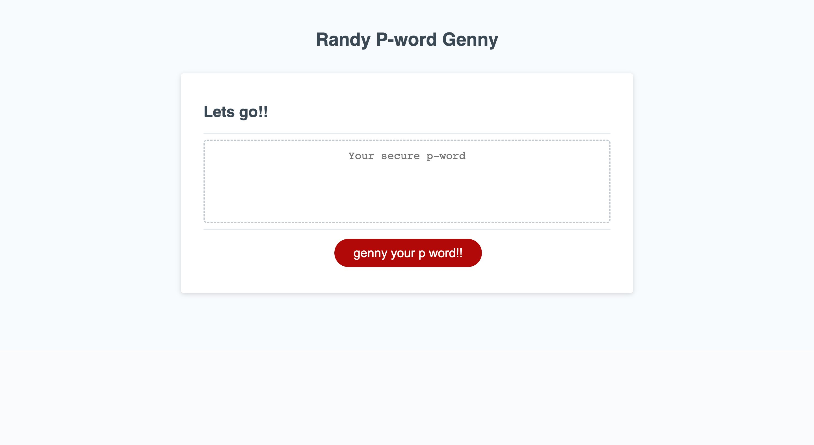

# p-word-genny

# Project Description

Create an application that generates a random password for the user based on criteria they've selected. This app will run in the browser, and will feature dynamically updated HTML and CSS powered by JavaScript code. It will have a clean and polished user interface that is responsive, ensuring that it adapts to multiple screen sizes.

## Content 

1. [Deployed Webpage](#deployed-webpage)
2. [Action Taken](#action-taken)

## Deployed Webpage

[Deployed Webpage](https://c-ramsey.github.io/p-word-genny/)

## Screenshot

## Action Taken

* Created arrays to hold the characters available to user for password generation
* Wrote functions for taking user's character type and password length preferences
* Wrote function to iterate over available character arrays and select at random based on user criterea to create password
* Wrote fun prompts to guide user through random password generation process

